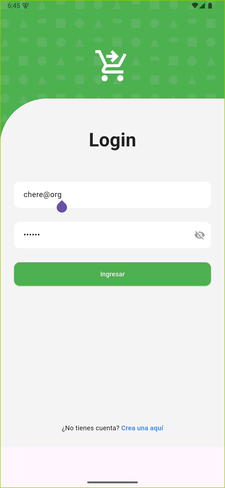

# 🔐 Login Flutter

**Proyecto base en Flutter para formularios de login modernos.**  
Diseñado como un punto de partida limpio, funcional y visualmente atractivo para cualquier aplicación móvil.  
Disponible para la comunidad, porque el conocimiento se comparte, como el café y los buenos commits.

---

## 🚀 Características

- 🧼 UI moderna inspirada en patrones de diseño actuales
- 📱 Soporte completo para móviles (pantalla completa + adaptabilidad)
- 🔐 Campos de autenticación con visibilidad toggle (mostrar/ocultar contraseña)
- 🎨 Fondo decorativo geométrico dinámico usando `CustomPainter`
- 📡 Preparado para conectar con APIs de login reales o mock
- 🧠 Estructura pensada para escalabilidad y modularización

---

## 📸 Capturas

| Pantalla Principal |
|--------------------|
||

> El diseño es responsive, con colores suaves y estructura pensada para UX de primer nivel.

---

